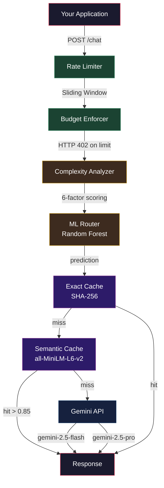

# Custos

[](https://github.com/OMCHOKSI108/custos/actions)
[](https://www.python.org/)
[](https://fastapi.tiangolo.com/)
[](https://render.com)

An intelligent LLM proxy that reduces Gemini API costs through smart routing, dual-layer semantic caching, budget enforcement, and rate limiting.

**Live API:** `https://custos.onrender.com/docs`

---

## Overview

Every LLM-powered product treats all queries the same. A simple factual question hits the same expensive model as a multi-paragraph architecture analysis. Custos fixes that by analyzing each query's complexity and routing it to the most cost-effective model.

> Custos achieved an average cost reduction of 60% across 100 test queries through intelligent routing and semantic caching. Simple queries routed to the cheaper model saved up to 90% per request.

---

## Architecture



The request pipeline consists of six sequential stages. A query first passes through rate limiting and budget enforcement. It then undergoes complexity analysis using six weighted signals. The ML router selects the optimal model based on historical training data. Before reaching the Gemini API, the system checks two caching layers: an exact SHA-256 hash cache and a semantic similarity cache using sentence-transformers embeddings with a cosine similarity threshold.

> The semantic cache handles paraphrased queries. Asking "What is machine learning?" and "Explain ML" returns the same cached response, eliminating redundant API calls and reducing latency by up to 60 milliseconds per hit.

---

## Features

**Complexity Analysis**

The analyzer scores queries from 0.0 to 1.0 using six weighted signals. Length accounts for 15 percent of the score, keyword matching for 40 percent, question count for 10 percent, code presence detection for 20 percent, technical jargon density for 10 percent, and sentence structure for 5 percent. Queries scoring below 0.35 route to gemini-2.5-flash while scores above 0.65 trigger gemini-2.5-pro.

**Dual Caching**

The caching system operates in two tiers. The exact cache generates a SHA-256 hash of each normalized query and returns a match in constant time. The semantic cache converts queries to 384-dimensional embeddings using all-MiniLM-L6-v2 and compares against stored entries using cosine similarity. Hits above the 0.85 threshold return the cached response. This combination increases cache hit rates from 25-30 percent to 35-45 percent, with each semantic hit saving approximately 50 milliseconds in embedding generation plus the full API call time.

**Budget Enforcement**

The enforcer tracks spending in daily and hourly buckets. Each request checks current spending against configurable limits and returns HTTP 402 when exceeded. Limits can be updated at runtime through the /budget/configure endpoint without restarting the server.

**Rate Limiting**

The sliding window rate limiter maintains a deque of timestamps per user, removing entries older than one hour before checking against the limit. This approach prevents burst abuse at window boundaries, a known weakness of fixed-window counters.

**Cost Prediction**

The /predict endpoint estimates the expense of a query before making an actual API call. It computes the complexity score, selects the target model, applies the model's per-token pricing, and returns an estimated cost value.

---

## Quick Start

Clone the repository and set up a virtual environment.

```
git clone https://github.com/OMCHOKSI108/custos.git
cd custos
python -m venv venv
source venv/bin/activate
pip install -r requirements.txt
```

Create a .env file from the example template and add your Gemini API key. Keys are available at aistudio.google.com without requiring a credit card.

```
cp .env.example .env
```

Launch the server with uvicorn and open the interactive API documentation at http://localhost:8000/docs.

```
uvicorn app.main:app --reload
```

---

## API Reference

| Endpoint | Method | Description |
|---|---|---|
| /chat | POST | Send a query and receive a routed LLM response |
| /stats | GET | Retrieve live metrics for cache, budget, routing, and latency |
| /predict | GET | Estimate cost for a query without making an API call |
| /compare | GET | Compare projected costs across all available models |
| /history | GET | View request log filtered by user_id |
| /export/csv | GET | Download complete request history as CSV |
| /train | POST | Train the ML router on accumulated request logs |
| /budget/configure | POST | Update spending limits at runtime |
| /cache | DELETE | Clear both exact and semantic caches |

---

## Testing

The test suite covers 37 tests across 5 modules using pytest.

```
python -m pytest tests/ -v
```

---

## Project Structure

```
custos/
  app/
    main.py           FastAPI application with all HTTP endpoints
    router.py         Six-layer pipeline orchestrator
    analyzer.py       Complexity scorer using six weighted signals
    cache.py          Exact match cache with LRU eviction and TTL
    semantic_cache.py Embedding similarity cache with cosine threshold
    budget.py         Daily and hourly spending tracker with enforcement
    rate_limiter.py   Per-user sliding window rate limiter
    ml_router.py      Random Forest classifier trained on request logs
    analytics.py      Pandas-based statistics aggregation
    logger.py         CSV-based request logging
    config.py         Environment variable configuration
  tests/              Unit and integration test suite
  frontend/dashboard/ Browser-based dashboard with Chart.js
  render.yaml         Render.com deployment configuration
```

---

## Author

**OMCHOKSI**

GitHub: https://github.com/OMCHOKSI108
